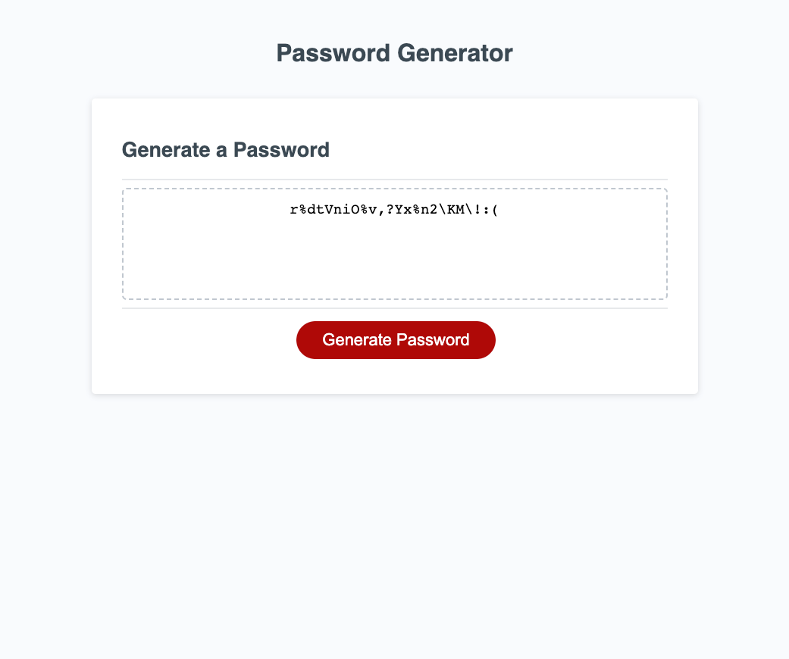

# Password-Generator
A Password Generator 

## Description
Password Generator webpage application choses a random password combination, based on the users input and selection of characters. 
Javascript will run through the users choices and will select a random password combination, and will display the results on screen
with the users chosen lenght and combination.

## Built With
* HTML
* CSS
* JavaScript ES6

## Screenshot

## Usage
Apon loading, click Generate Password button to initialise a password promp for the user to select the length of their password. 
After inputting the password lenght, a series of prompts will determin what characters the password wil contain.
You can try the Password Generator [here](https://chriscds.github.io/Password-Generator/index.html).

## License
Please refer to the LICENCE in the repository.